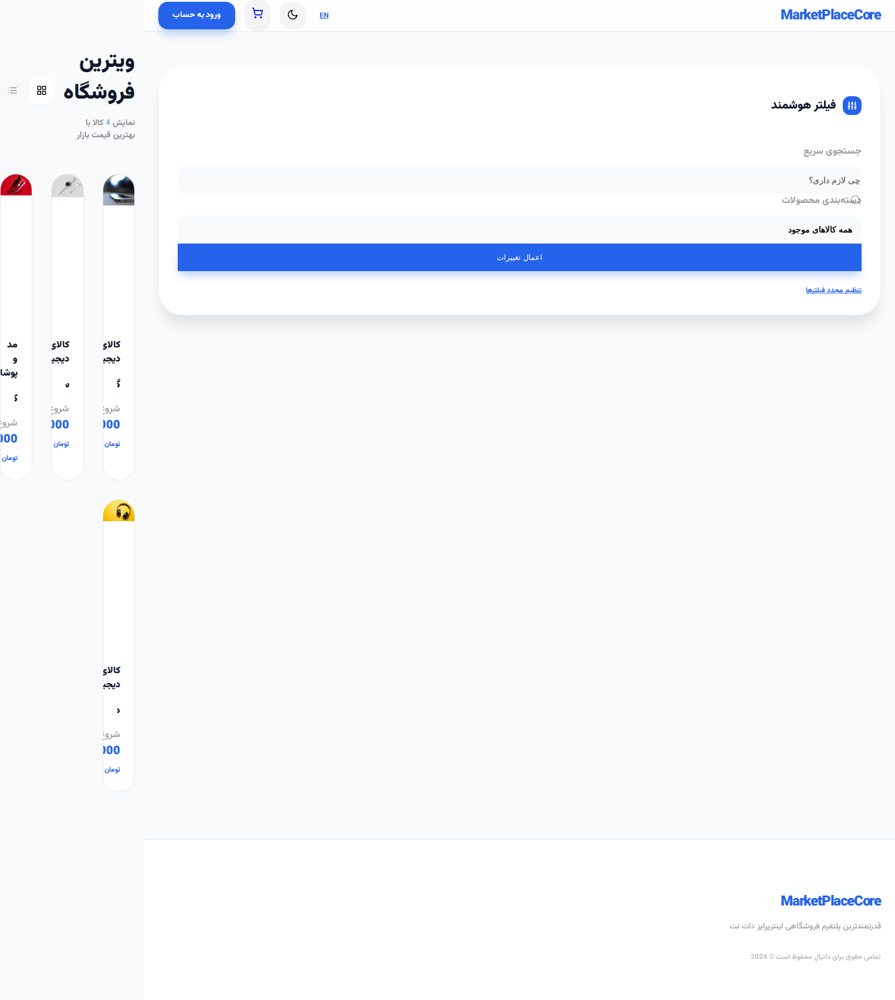
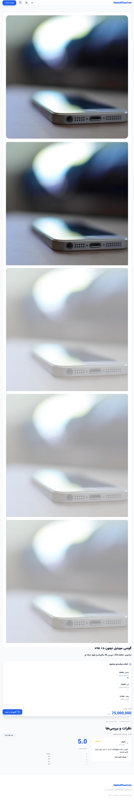
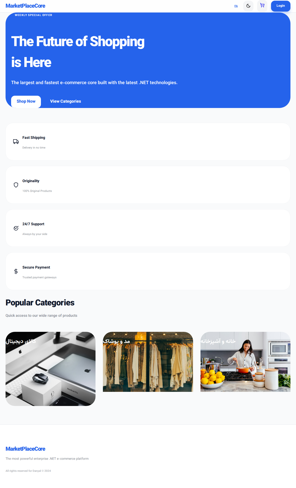
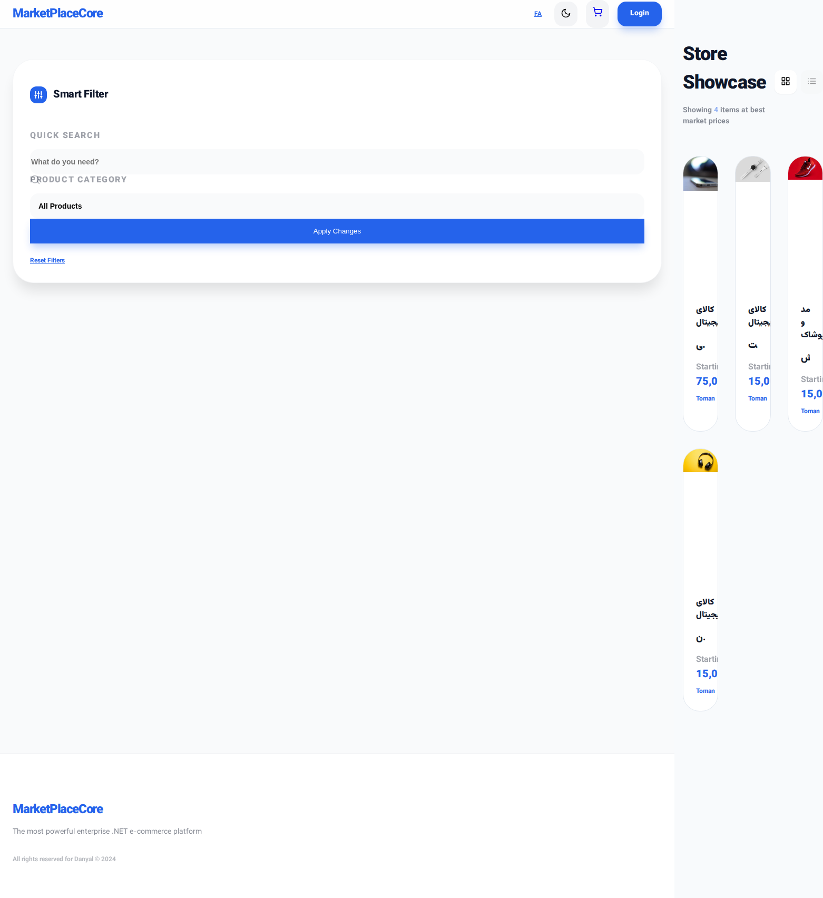
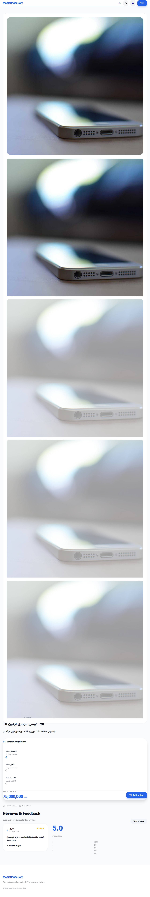

# MarketPlaceCore - سامانه فروشگاهی پیشرفته (Enterprise Edition)

یک سامانه جامع و پیشرفته تجارت الکترونیک که با استفاده از **ASP.NET Core 8.0** و با پیروی از اصول معماری تمیز (Clean Architecture)، الگوهای Repository و Unit of Work پیاده‌سازی شده است.

## ویژگی‌های کلیدی

### ۱. معماری و طراحی
- **معماری تمیز (Clean Architecture):** جداسازی لایه‌های Core، Infrastructure و Web برای نگهداری و تست‌پذیری بهتر.
- **Tailwind CSS:** رابط کاربری مدرن و واکنش‌گرا با تنظیمات محلی Tailwind (بدون وابستگی به CDN).
- **فونت وزیر‌متن:** ادغام فونت زیبای وزیر‌متن برای تجربه تایپوگرافی برتر.
- **پایگاه داده:** استفاده از SQLite به صورت پیش‌فرض برای راه‌اندازی بدون نیاز به تنظیمات، با قابلیت تغییر آسان به SQL Server یا PostgreSQL.

### ۲. قابلیت‌های فروشگاهی
- **تنوع محصولات:** مدیریت موجودی و قیمت بر اساس ویژگی‌ها (رنگ، سایز و غیره).
- **سیستم تخفیف:** موتور پیشرفته کوپن با قوانین اعتبارسنجی متنوع.
- **خریداران تایید شده:** سیستم نظرات برای جلب اعتماد، با نمایش بازخوردهای خریداران واقعی.
- **احراز هویت:** ورود امن با استفاده از JWT و شبیه‌سازی ورود با رمز یکبار مصرف (OTP).

## تصاویر برنامه (نسخه فارسی)

### صفحه اصلی


### لیست محصولات


### جزئیات محصول


## راهنمای راه‌اندازی سریع

### استفاده از داکر (پیشنهادی)
برای اجرای سریع پروژه با داکر، این دستور را در دایرکتوری اصلی اجرا کنید:

```bash
docker-compose up --build
```
برنامه در آدرس `http://localhost:8080` در دسترس خواهد بود. پایگاه داده به طور خودکار آماده‌سازی شده و با داده‌های نمونه غنی و تصاویر با کیفیت از Unsplash پر می‌شود.

### اجرای محلی
۱. اطمینان حاصل کنید که .NET 8.0 SDK نصب شده است.
۲. دستور زیر را اجرا کنید:
   ```bash
   dotnet run --project MarketPlaceCore/src/MarketPlaceCore.Web/MarketPlaceCore.Web.csproj
   ```

## مستندات فنی
- [مستندات API](MarketPlaceCore/readmeapi.md)
- [راهنمای ادغام اندروید](MarketPlaceCore/androidreadmeapi.md)

---

# MarketPlaceCore - Modern E-commerce Platform (Enterprise Edition)

A comprehensive and advanced e-commerce system built with **ASP.NET Core 8.0** following Clean Architecture principles, Repository, and Unit of Work patterns.

## Key Features

### 1. Architecture & Design
- **Clean Architecture:** Separation of Core, Infrastructure, and Web layers for better maintainability and testability.
- **Tailwind CSS:** Modern, responsive UI with local Tailwind configuration (no CDN dependency).
- **Vazirmatn Font:** Integration of the beautiful Vazirmatn font for an enhanced typography experience.
- **Database:** SQLite by default for zero-config setup, easily switchable to SQL Server or PostgreSQL.

### 2. E-commerce Capabilities
- **Product Variants:** Manage stock and pricing per attribute (Color, Size, etc.).
- **Discount Engine:** Advanced coupon system with various validation rules.
- **Verified Buyers:** Trust-building review system highlighting feedback from actual purchasers.
- **Authentication:** Secure login via JWT and simulated OTP mobile-based login.

## Application Screenshots (English Version)

### Home Page


### Product List


### Product Details


## Quick Start Guide

### Using Docker (Recommended)
To get the project up and running quickly with Docker, execute this command in the root directory:

```bash
docker-compose up --build
```
The application will be accessible at `http://localhost:8080`. The database is automatically provisioned and seeded with rich sample data and high-quality images from Unsplash.

### Local Execution
1. Ensure you have the .NET 8.0 SDK installed.
2. Run the following command:
   ```bash
   dotnet run --project MarketPlaceCore/src/MarketPlaceCore.Web/MarketPlaceCore.Web.csproj
   ```

## Technical Documentation
- [API Documentation](MarketPlaceCore/readmeapi.md)
- [Android Integration Guide](MarketPlaceCore/androidreadmeapi.md)

---
All rights reserved &copy; 2024
